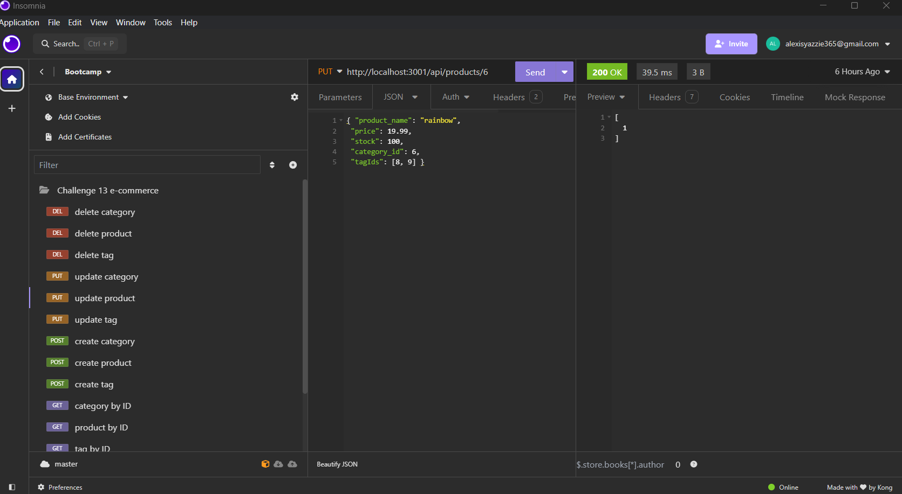

# E-Commerce Database




## Description
Created a back-end for an e-commerce website that stores data for products and prices.

## Table of Contents
- [Description](#description)
- [Installation](#installation)
- [Usage](#usage)
- [Tests](#tests)
- [Questions](#questions)

## Installation
```
Use the .env.EXAMPLE file and input the users postgress uservname and password, and use npm i to install all the necessary packagaes to run the program, then proceed to use the database and seed files to populate the database. This also requires insomnia to create and test the get, post, put, and delete commands.
```

## Usage
It stores data related to products on an example e-commerce database for easy access for users on a website.

## Tests
Run the get, post, put, and delete functions in insomnia and record any error messages.

## Questions
If you have any questions please go to my github:
https://github.com/SleekWingX 